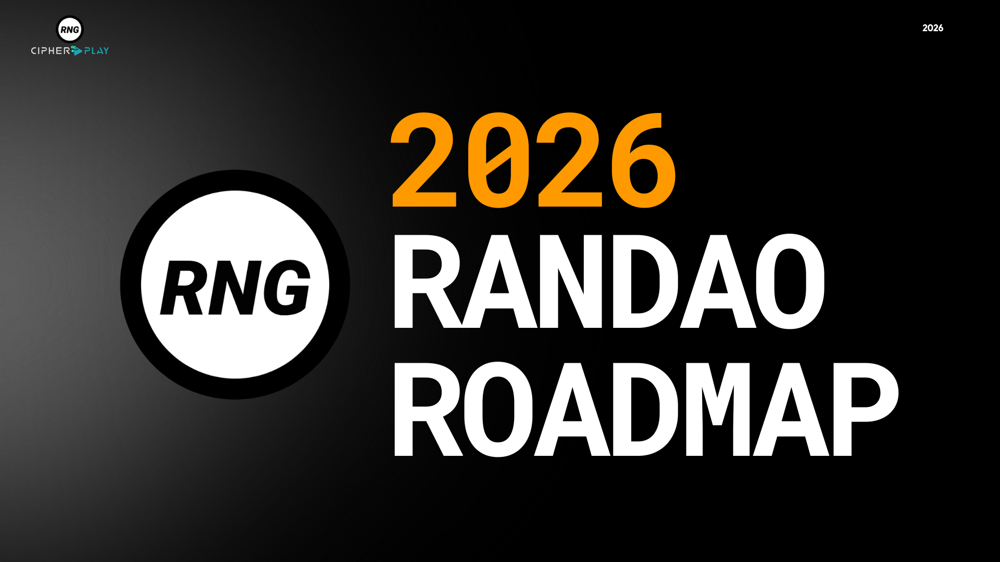
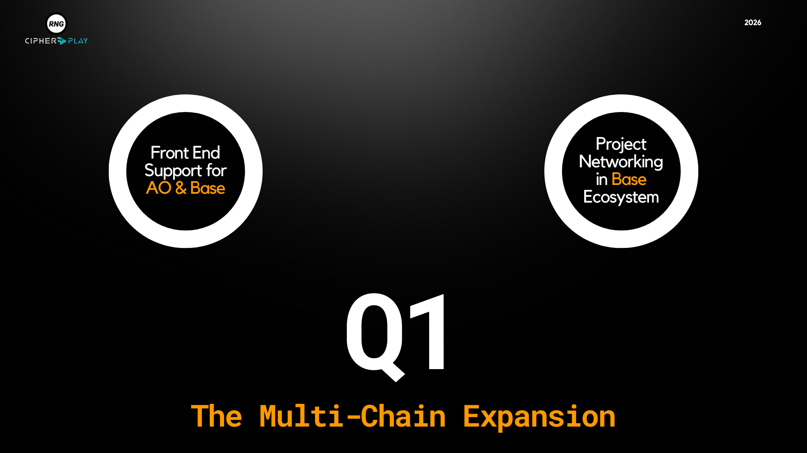
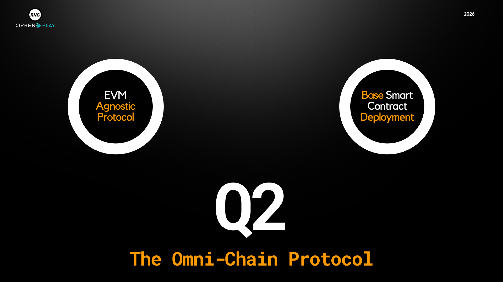
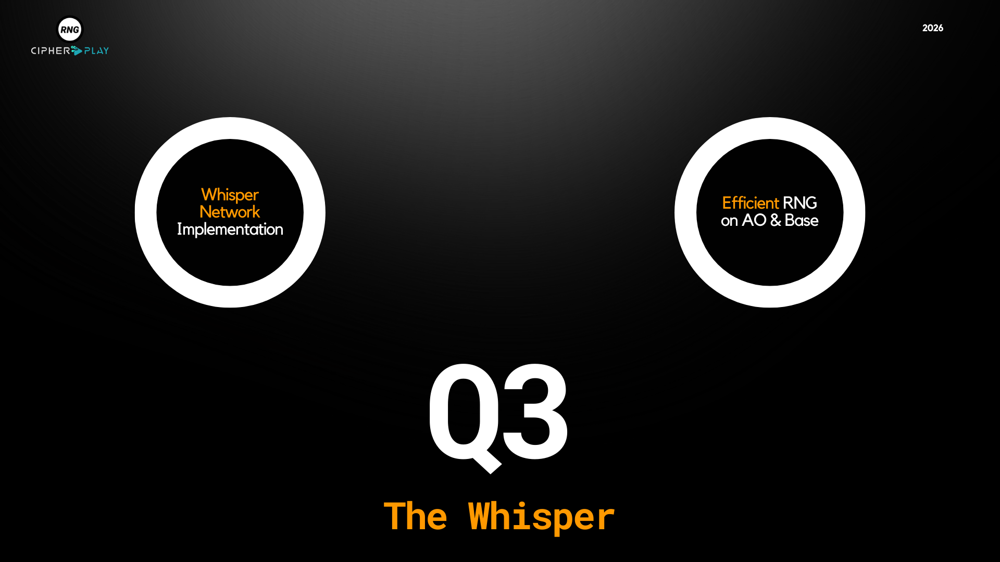
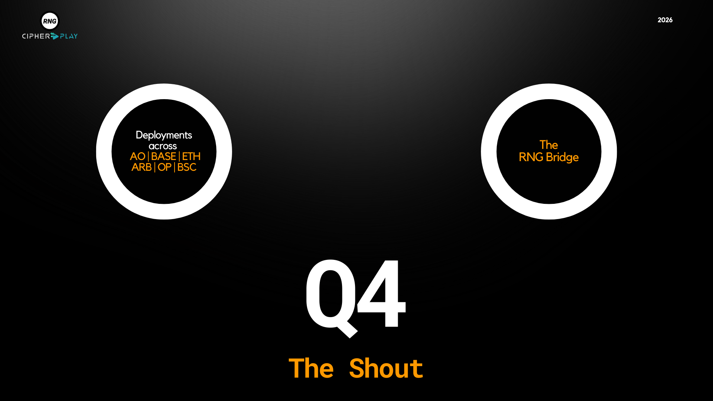
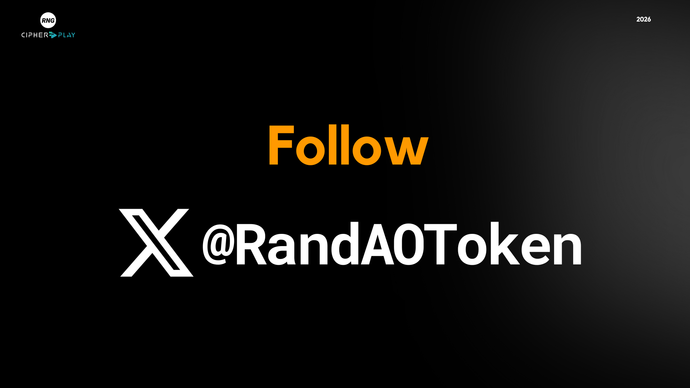

# 🛣️ 2026 RANDAO Roadmap

This roadmap outlines RANDAO’s strategic vision for 2026 — driving innovation across multi-chain infrastructure, EVM interoperability, secure randomness, and cross-chain deployment. Each quarter marks a significant leap toward realizing an efficient, decentralized future for verifiable randomness.
{/* truncate */}
---

## 🔶 Q1 — The Multi-Chain Expansion

RANDAO will introduce front-end support enabling users to connect wallets from both AO and Base chains seamlessly. In parallel, key ecosystem partnerships—especially with wallets and potential clients—will be established within the Base network.

---

## 🟠 Q2 — The Omni-Chain Protocol

RANDAO evolves into an EVM-agnostic protocol, unlocking the ability to deploy its smart contracts across any EVM-compatible chain with minimal friction. Base will be the first EVM network supported, laying the foundation for expansive cross-chain functionality.

---

## 🟡 Q3 — The Whisper

An off-chain Whisper Network will be implemented to power efficient coordination and communication within the RANDAO ecosystem. This innovation will optimize the protocol’s performance, enabling faster and more efficient RNG on both AO and Base.

---

## 🟠 Q4 — The Shout

RANDAO goes live across major networks including AO, Base, Ethereum, Arbitrum, Optimism, and BSC—paving the way for its official token launch. The RNG Bridge will simultaneously enable seamless token transfers between AO and all supported EVM chains.

---

